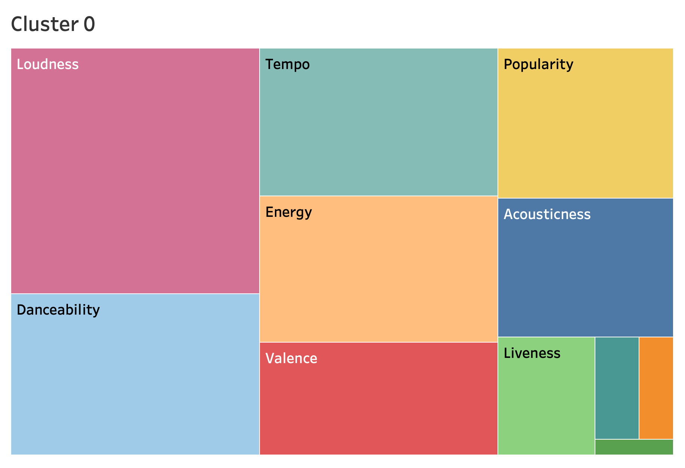

# Music Analysis with ML

This project uses machine learning to find common attributes in tracks from Spotify, beyond their artists or genre, and presents the results through interactive visualizations.

Table of Contents
- [Music Analysis with ML](#music-analysis-with-ml)
  - [Repository Organization](#repository-organization)
  - [Previous Project Work](#previous-project-work)
    - [Music Attributes](#music-attributes)
    - [Data Source](#data-source)
  - [Machine Learning Methods](#machine-learning-methods)
    - [Data Cleaning](#data-cleaning)
    - [ML Model](#ml-model)
  - [API](#api)
    - [v1.0/](#v10)
    - [v2.0/](#v20)
  - [ML Visualizations](#ml-visualizations)
  - [Observations](#observations)
  - [Potential Evolution](#potential-evolution)
  - [Our Team](#our-team)

## Repository Organization
Files used for the final deployment of our project are saved in the Main folder.  Additional files in separate folders may have been used to aid our development of the application.  Files for the API deployment are saved [here.](Jake/ZappaDeployment2/)

## Previous Project Work
This project is based on work done in the [Musical Attribute Analysis Project](https://github.com/alexdanieldelcampo/Musical_Analysis), which takes a dataset of Spotify music data summarized by year, genre, and artist and presents visualizations of the data.

In this update, we are looking at relationships between songs of all genres as defined by their attributes, summarized below.

### Music Attributes

Spotify quantifies different music attributes for tracks in their libary.  The attributes can be described as follows:

|Attribute|Range|Description|
|-|-|-|
|Acousticness|0.0 to 1.0|A confidence measure of how acoustic a song is.|
|Danceability|0.0 to 1.0|How suitable for dancing using tempo, rhythem stability, beat strength, and regularity.|
|Energy|0.0 to 1.0|A measure of intesity and activity using tempo, loudness, and noisiness.|
|Instrumentalness|0.0 to 1.0|How confident that a song has no vocals.|
|Liveness|0.0 to 1.0|How confident that a song was performed in front of an audience. |
|Loudness|-∞ to 0|Negative values are how much restriction is placed on a given system. The closer it is to 0, the louder it is.|
|Speechiness|0.0 to 1.0|How much a song/track consists of entirely spoken words.|
|Tempo|0.0 to ∞ |The speed or pace of a given track. Given in beats per minute.|
|Valence|0.0 to 1.0|How much positive emotion a song has.|

Source/Further Reading: [theverge.com](https://www.theverge.com/tldr/2018/2/5/16974194/spotify-recommendation-algorithm-playlist-hack-nelson)

### Data Source

This project is based on a Spotify dataset available on Kaggle.com:

[Spotify Dataset 1922-2021](https://www.kaggle.com/yamaerenay/spotify-dataset-19212020-160k-tracks)

## Machine Learning Methods
The goals of this project are to find new relationships between songs that may not be reflected by genres alone, whcih may not be consistent within artists.  Some songs may fall into different genres but still have similar characteristics. If you have a pop song with a rap verse, is it a rap song or a pop song?

Some artists can be described by multiple genres as their music evolves during their careers.  Would you say that Taylor Swift is a country artist or a pop artist?  

Our original approach was focused on using genre labels to train a supervised ML model to predict the genre of a song based on the attributes of the song.  However, our dataset consists of artists who have multiple genre labels, and some songs themselves have multiple artists.  This would result in some songs having multiple genre labels; within our dataset, there are nearly 3,000 distinct genre labels.  While many of these labels are geographic or cultural variations of larger genres (e.g., LA Indie, Kentucky Indie, Kindie), we didn't want to make the assumption that all genres can be cleanly described by their "parent" genre (that's why they've got the different label, right?).

Our solution is to use an unsupervised model to group songs into clusters, and to then look at the attribute values and genres which describe those clusters.  We used a K-Means Clustering Model and workflow to assign clustering labels to our data for this analysis.

### Data Cleaning
Prior to adding the data to the K-Means clustering model, we cleaned our data by finding all of the artists who do not have any genre labels and removing tracks that only had those artists from the dataset.  This ensures that after K-Means has clustered the tracks, we can review the original genres to see if there are common genres.  We also scaled attributes where appropriate to avoid bias from data values.

### ML Model
A K-Means clustering model allows you to specify how many clusters you'd like to break your dataset into, and will return the input data with the assigned cluster number.  We determined that our dataset could be described in 10 clusters using the [Elbow Method](https://en.wikipedia.org/wiki/Elbow_method_(clustering)) (guide on implementation [here](https://towardsdatascience.com/k-means-clustering-algorithm-applications-evaluation-methods-and-drawbacks-aa03e644b48a)) to estimate how to effectively break the data into clusters, as shown below:

## API

After data cleaning, the Spotify music data was compiled into databases.  Using Flask, Zappa, and SQLite and AWS DynamoDB databases, the API routes can be used to return JSON-format data to drive our visualizations.

Full set of API routes available [here](https://nxvasw6as4.execute-api.us-west-1.amazonaws.com/dev/).  The main API used in this project are described below.

### v1.0/
This version of the API was constructed by incoprorating cleaned data csv files into a SQLite database, and uploading that SQLite database file with the Zappa deployment to AWS.  Queries are handled in Python using SQLAlchemy.

The main API routes include:
- Data by Year - [/api/v1.0/data_by_year](https://nxvasw6as4.execute-api.us-west-1.amazonaws.com/dev/api/v1.0/data_by_year)
  - Returns averaged attributes for tracks by year.  A total of 102 rows of data.
- Data by Genre - [/api/v1.0/top_51_genres](https://nxvasw6as4.execute-api.us-west-1.amazonaws.com/dev/api/v1.0/top_51_genres)
  - Returns averaged attributes for tracks by genre.  A total of 51 rows of data.  List of top 51 genres determined by scraping popular music genres from Google.
- Data by Artist - [/api/v1.0/data_by_artist_clean/&lt;artist&gt;](https://nxvasw6as4.execute-api.us-west-1.amazonaws.com/dev/api/v1.0/data_by_artist_clean/The%20B-52's)
  - Returns averaged attributes for tracks for a single artist.  28,680 artists are available in the SQLite database.
  - When adding the artist name at the end of the URL (replace "&lt;artist&gt;" with your artist of interest), please use the correct spelling, punctuation, capitalization, and spacing.  Note any accents or special characters (she's Beyoncé, not Beyonce).

### v2.0/

This version of the API was constructed by creating JSONs of the data for each table which were uploaded to AWS DynamoDB.  Queries are handled in Python using boto3.

The main API routes include:
- Tracks with ML cluster assignments, artists, and genre lists -  [/api/v2.0/Music_ML_tracks/&lt;track&gt;](https://nxvasw6as4.execute-api.us-west-1.amazonaws.com/dev/api/v2.0/Music_ML_tracks/All%20Star)
  - Returns a JSON object that contains the ML cluster assignment ("Assignments"), a list of artists that have made a song with this title ("artists"), a list of genre lists for each artist ("genres"), and a list of Spotify track IDs ("id") for a given track name.
  - When adding the track name at the end of the URL (replace "&lt;track&gt;" with the track name), please use the correct spelling, punctuation, capitalization, and spacing.  Note any accents or special characters.  Some tracks may have very specific names (Beyoncé sings "[Crazy in Love (feat. Jay-Z)](https://nxvasw6as4.execute-api.us-west-1.amazonaws.com/dev/api/v2.0/Music_ML_tracks/Crazy%20in%20Love%20(feat.%20Jay-Z))", not to be confused with "[Crazy in Love](https://nxvasw6as4.execute-api.us-west-1.amazonaws.com/dev/api/v2.0/Music_ML_tracks/Crazy%20in%20Love)").
- Sets of Ten Tracks by Assignments
  - Returns a set of ten tracks with artist, song id, and ML assignment cluster.  "Fixed"  "Random" .
	- Fixed (returns a fixed set of tracks for each assignment number): [/api/v2.1/Fixed_Song_Assignments/&lt;Assignments&gt;](https://nxvasw6as4.execute-api.us-west-1.amazonaws.com/dev/api/v2.1/Fixed_Song_Assignments/0)
	- Random (returns a random set of 10 tracks and related data from the specified cluster number): [/api/v2.1/Random_Song_Assignments/&lt;Assignments&gt;](https://nxvasw6as4.execute-api.us-west-1.amazonaws.com/dev/api/v2.1/Random_Song_Assignments/0)

## ML Visualizations

Visualizations are built with Tableau and present the average values of the song attributes and the top genre labels in each cluster.

  

## Observations
The K-Means clustering does a great job of handling tracks that include a lot of spoken word/speech, as shown by the groupings into Cluster 5.  These tracks appear to be from audiobooks or radio plays and are consistenly labeled as having a high speech content, low instrumental content.  Clusters 7 and 9 are grouped nicely; these clusters include instrumental pieces with low valence (sadder songs, Cluster 7) and instrumental pieces with higher valence (happier songs, Cluster 9).  Cluster 7 includes orchestra and opera genres, while Cluster 9 includes the more upbeat swing, jazz, and big band genres.

The clustering is not perfect, especially when looking at randomly generated tracks that are within a given cluster.  Using the song discovery application sometimes results in confusing and humorous recommendations!  

## Potential Evolution

Going forward, we would like to incorporate an embedded Spotify player to queue up the tracks that are suggested at random into a playlist so the user can listen to the songs for themselves.  

## Our Team

[alexdanieldelcampo](https://github.com/alexdanieldelcampo/)

[DavidZapataCSUF](https://github.com/DavidZapataCSUF)

[jakemperry](https://github.com/jakemperry)

[sabrinawjo](https://github.com/sabrinawjo)

[ytran010](https://github.com/ytran010)

